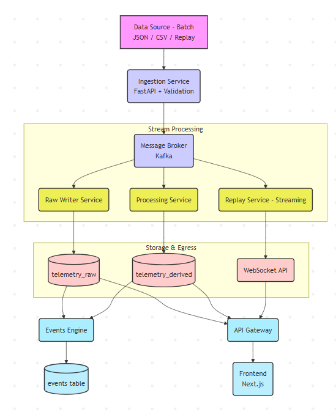

# telemetry-system
This is a Real telemetry Analytics system and this is a extension of the Stimulation tool

## Architecture

### Components

*   **Data Source - Batch**: Handles batch data sources like JSON, CSV, or replays.
*   **Ingestion Service**: A FastAPI-based service for data ingestion and validation.
*   **Stream Processing**:
    *   **Message Broker (Kafka)**: Manages real-time data streams.
    *   **Raw Writer Service**: Subscribes to Kafka to write raw data.
    *   **Processing Service**: Subscribes to Kafka for data processing.
    *   **Replay Service - Streaming**: Subscribes to Kafka for replaying streams.
*   **Storage & Egress**:
    *   **telemetry_raw**: Database for raw telemetry data.
    *   **telemetry_derived**: Database for derived or processed data.
    *   **WebSocket API**: Provides real-time data egress via WebSockets.
*   **Events Engine**: Processes data from `telemetry_raw` to generate events.
*   **events table**: Stores the events generated by the Events Engine.
*   **API Gateway**: Single entry point for frontend requests.
*   **Frontend**: A Next.js application for the user interface.

## Dataset Features

### Root Metadata Keys (meta)
These keys describe the flight session as a whole:
*   `meta.version` (Type: String/Mixed) – The telemetry schema version (e.g., "2.1").
*   `meta.drone` (Type: String/Mixed) – The active drone profile parameters configuration.
*   `meta.exported` (Type: String/Mixed) – The ISO 8601 timestamp representing when the file was generated.

### Live Telemetry Logs (frames)
Each frame in the log represents a specific snapshot in time containing the following key-value pairs:
*   `t` (Type: Float) – Shared simulation timestamp / clock time.
*   `px`, `py`, `pz` (Type: Float) – 3D Position coordinates (X, Y, Z).
*   `roll`, `pitch`, `yaw` (Type: Float) – Euler rotation angles.
*   `gx`, `gy`, `gz` (Type: Float) – Gyroscope angular velocity rates.
*   `accX`, `accY`, `accZ` (Type: Float) – Body-frame accelerometer readings.
*   `vx`, `vy`, `vz` (Type: Float) – Velocity vector values.
*   `m0`, `m1`, `m2`, `m3` (Type: Float) – Output commands applied to each of the 4 motors.
*   `rpm0`, `rpm1`, `rpm2`, `rpm3` (Type: Float) – Rotational speeds (RPM) of each motor.
*   `batt` (Type: Float) – Current battery voltage.
*   `curr` (Type: Float) – Electrical current draw (Amperes).
*   `batt_pct` (Type: Float) – Battery remaining percentage.
*   `baro_raw` (Type: Float) – Raw barometric altitude reading.
*   `baro_filtered` (Type: Float) – Filtered barometric altitude estimate.
*   `wind_x`, `wind_z` (Type: Float) – Environmental wind vector coordinates.
*   `dryden_x`, `dryden_y`, `dryden_z` (Type: Float) – Dryden turbulence wind gust values.
*   `gps_lat`, `gps_lon` (Type: Integer) – Simulated GPS latitude and longitude (multiplied by 1e7).
*   `gps_fix` (Type: Integer) – GPS fix type indicator.
*   `gps_sat` (Type: Integer) – Count of visible GPS satellites.
*   `gps_eph` (Type: Integer) – Estimated horizontal position error.
*   `gps_epv` (Type: Integer) – Estimated vertical position error.
*   `obs_fwd`, `obs_right`, `obs_back`, `obs_left`, `obs_up` (Type: Float) – Obstacle distance sensor outputs (FWD, RIGHT, BACK, LEFT, UP).
*   `mode` (Type: String) – Flight controller mode (stabilized, angle, acro, althold, gpshold, rth).
*   `armed` (Type: Boolean) – Drone arm state.
*   `crashed` (Type: Integer) – Flag indicating if the drone has crashed (1 or 0).
*   `grounded` (Type: Integer) – Flag indicating if the drone is on the ground (1 or 0).
*   `ground_y` (Type: Float) – Terrain altitude directly below the drone.
*   `dmg0`, `dmg1`, `dmg2`, `dmg3` (Type: Float) – Motor damage percentage values (FR, FL, BL, BR).
*   `input_throttle` (Type: Float) – The pilot's current throttle control input.
*   `input_pitch` (Type: Float) – The pilot's current pitch control stick position.
*   `input_roll` (Type: Float) – The pilot's current roll control stick position.
*   `input_yaw` (Type: Float) – The pilot's current yaw control stick position.
*   `pid_roll_err` / `pid_roll_out` (Type: Float) – Roll axis PID loop error and control output.
*   `pid_pitch_err` / `pid_pitch_out` (Type: Float) – Pitch axis PID loop error and control output.
*   `pid_yaw_err` / `pid_yaw_out` (Type: Float) – Yaw axis PID loop error and control output.
*   `pid_alt_err` / `pid_alt_out` (Type: Float) – Altitude axis PID loop error and control output.

